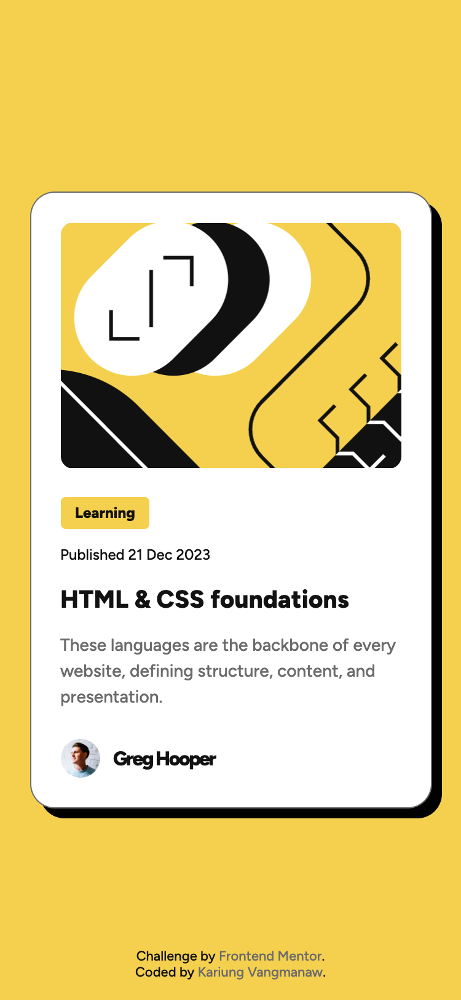
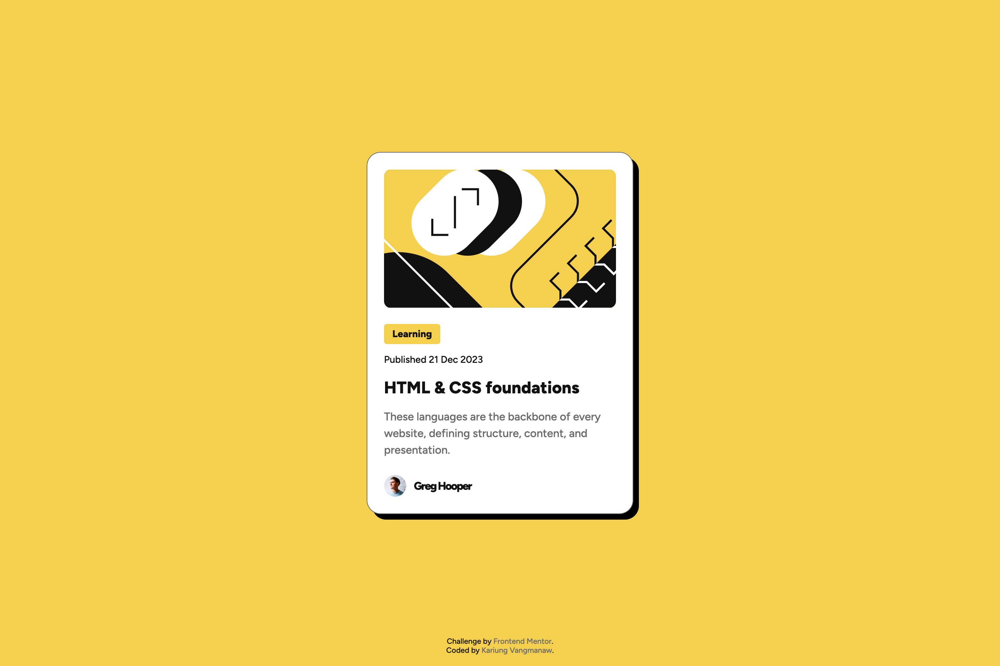

# Frontend Mentor - Blog preview card solution

This is a solution to the [Blog preview card challenge on Frontend Mentor](https://www.frontendmentor.io/challenges/blog-preview-card-ckPaj01IcS). Frontend Mentor challenges help you improve your coding skills by building realistic projects.

## Table of contents

- [Frontend Mentor - Blog preview card solution](#frontend-mentor---blog-preview-card-solution)
  - [Table of contents](#table-of-contents)
  - [Overview](#overview)
    - [The challenge](#the-challenge)
    - [Challenge result](#challenge-result)
    - [Screenshot](#screenshot)
    - [Links](#links)
  - [My process](#my-process)
    - [Built with](#built-with)
    - [What I learned](#what-i-learned)
    - [Continued development](#continued-development)
  - [Author](#author)
  - [Acknowledgments](#acknowledgments)

## Overview

### The challenge

Users should be able to:

- See hover and focus states for all interactive elements on the page

### Challenge result

- **10 Sep 2025**
  - ✅ See hover and focus states for all interactive elements on the page

### Screenshot

- Mobile view

  

- Desktop view

  

- Active state view

  

### Links

- Solution URL: [Blog Preview Card Challenge using HTML5 and CSS](https://www.frontendmentor.io/solutions/blog-preview-card-challenge-using-html5-and-css-RDFoXDYTWw)
- Live Site URL: [Frontend Mentor Challenge | Blog preview card](https://vangmanawkairung.github.io/frontend-mentor-blog-preview-card/)

## My process

### Built with

- Semantic HTML5 markup
- CSS custom properties (CSS Variables)
- Flexbox
- Absolute positioning and media queries
- Mobile-first workflow
- Google Fonts (Figtree)
- Figma – for design and layout reference

### What I learned

One of my key learnings in this project was working with Figma designs and translating them into a functional web page. This experience helped me practice how to carefully analyze spacing, alignment, colors, and typography in the design, then implement them using semantic HTML and CSS. I also realized how Figma can make the process more efficient, and I gained more confidence in building a responsive layout directly from a design file.

### Continued development

In future projects, I want to continue improving my skills in Figma. Currently, I am only using the basic features, and I believe there are many advanced functions that could help speed up my workflow and make the design-to-code process more efficient. My goal is to explore these tools further and integrate them effectively into my development process.

## Author

- GitHub: [Kirung Vangmanaw](https://github.com/VangmanawKairung)
- Frontend Mentor - [@VangmanawKairung](https://www.frontendmentor.io/profile/VangmanawKairunge)

## Acknowledgments

I would like to sincerely thank myself for staying persistent and continuing to push forward. A big thank you to the **Frontend Mentor team** for creating this challenge and giving me the opportunity to practice and improve my skills. I am also grateful to **OpenAI** and **Google** for developing **ChatGPT** and **Gemini**, which helped me complete this challenge and explore new techniques. A special thanks to **Figma** for providing an intuitive design tool that made translating designs into code much smoother. Lastly, I want to express my appreciation to every tool, program, and source of encouragement that supported me throughout this process. Without them, completing this challenge successfully would not have been possible.
